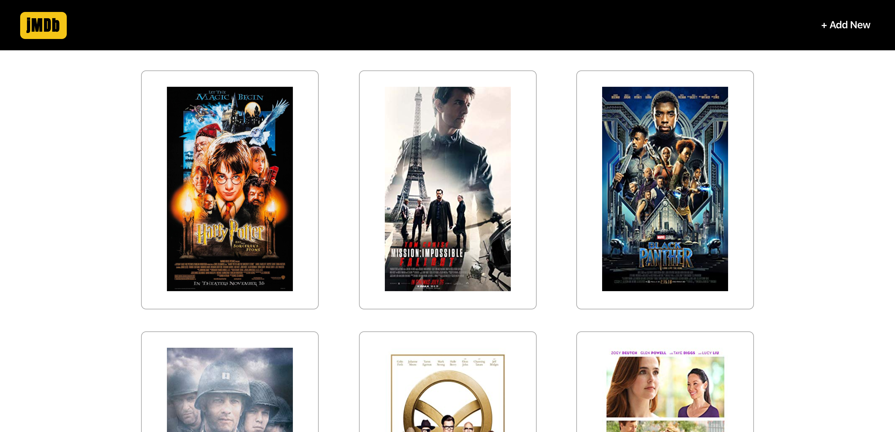

# jMDb
This MERN, full-stack application a JSON API which can be found <a href="https://github.com/jmripper/Backend-API">here</a>. The front-end, built with React.js, has full CRUD capability in order to keep track of your favorite movies. The site is built to be full responsive on all devices.

## Languages Used
- React.js
- CSS

## Deployed Website:
Deployed using AWS Amplify, https://jmdb.netlify.com/

